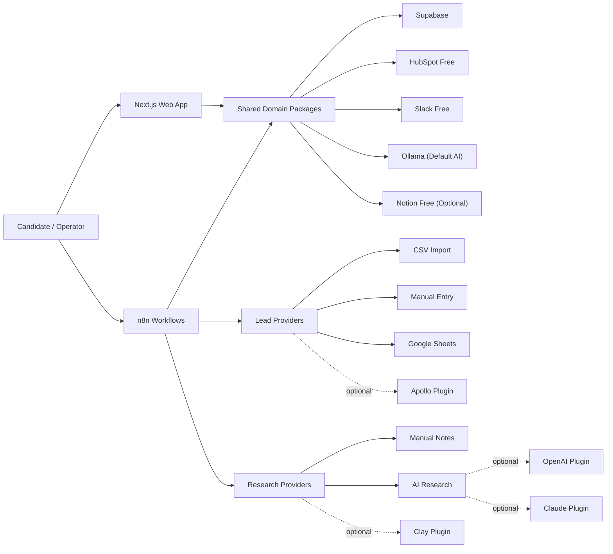
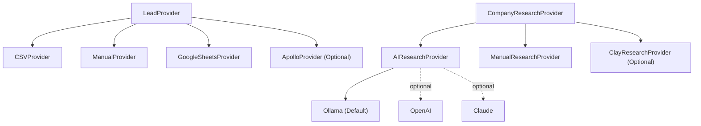

# Architecture Diagrams

## Free-First System Diagram

```mermaid
flowchart LR
  user["Candidate / Operator"] --> web["Next.js Web App"]
  user --> workflows["n8n Workflows"]
  web --> domain["Shared Domain Packages"]
  workflows --> domain
  domain --> db["Supabase"]
  domain --> hubspot["HubSpot Free"]
  domain --> slack["Slack Free"]
  domain --> ollama["Ollama (Default AI)"]
  domain --> notion["Notion Free (Optional)"]
  workflows --> leads["Lead Providers"]
  workflows --> research["Research Providers"]
  leads --> csv["CSV Import"]
  leads --> manual["Manual Entry"]
  leads --> sheets["Google Sheets"]
  leads -. optional .-> apollo["Apollo Plugin"]
  research --> notes["Manual Notes"]
  research --> ai["AI Research"]
  ai -. optional .-> openai["OpenAI Plugin"]
  ai -. optional .-> claude["Claude Plugin"]
  research -. optional .-> clay["Clay Plugin"]
```

## Provider Abstraction Diagram

```mermaid
flowchart TB
  leadInterface["LeadProvider"] --> csvProvider["CSVProvider"]
  leadInterface --> manualProvider["ManualProvider"]
  leadInterface --> sheetsProvider["GoogleSheetsProvider"]
  leadInterface --> apolloProvider["ApolloProvider (Optional)"]

  researchInterface["CompanyResearchProvider"] --> aiResearch["AIResearchProvider"]
  researchInterface --> manualResearch["ManualResearchProvider"]
  researchInterface --> clayResearch["ClayResearchProvider (Optional)"]

  aiResearch --> ollamaDefault["Ollama (Default)"]
  aiResearch -. optional .-> openaiOptional["OpenAI"]
  aiResearch -. optional .-> claudeOptional["Claude"]
```
